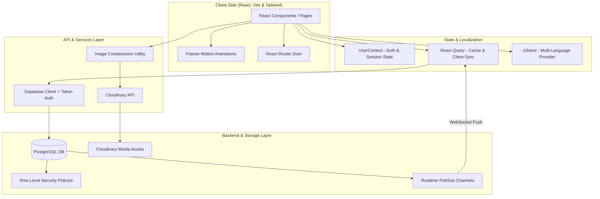

# PawConnect 🐾

PawConnect (`pawconnect.lk`) is a modern, community-driven web application designed to connect stray, abandoned, and lost animals in Sri Lanka with loving forever homes. By offering a platform to report strays, post active lost alerts, and browse adoptable pets, PawConnect empowers local communities to make a life-saving impact.

---

## ✨ Features

- **🐾 Browse Animals**: View reported stray animals waiting for adoption, displayed in a responsive grid layout with custom cards.
- **🚨 Lost & Found Alerts**: Active ticker carousel on the Home screen highlighting recent missing pets in the neighborhood.
- **📱 Mobile-Tab-Bar Layout**: Sleek mobile navigation mimicking native application experiences, along with responsive layouts for desktops.
- **🔍 Advanced Filtering**: Dynamic filters for species (Dogs, Cats), gender, and status, complete with collapsible mobile menus.
- **📍 Report Strays & Lost Pets**: Authenticated users can publish detailed reports including visual media, contact details, and locations.
- **💬 Real-Time Interactions**: Support for community likes, reactions, and comments directly on pet detail pages.
- **🗣️ Multi-Lingual Support**: Complete localization in **English (`en`)**, **Sinhala (`si`)**, and **Tamil (`ta`)**.
- **📊 Analytics Dashboard**: Visual analytics showing statistics on total rescues, monthly adoptions, and geographic distributions.

---

## 🏗️ System Architecture



---

## 🛠️ Technology Stack

- **Frontend Core**: [React 18](https://reactjs.org/) + [Vite](https://vitejs.dev/) + [TypeScript](https://www.typescriptlang.org/)
- **State Management & Caching**: [TanStack Query (React Query v5)](https://tanstack.com/query/v5)
- **Styling**: [Tailwind CSS](https://tailwindcss.com/) + Custom CSS transitions & glassmorphic utilities
- **Database & Real-time**: [Supabase](https://supabase.com/) (PostgreSQL + Real-time Listeners)
- **Animations**: [Framer Motion](https://www.framer.com/motion/) (micro-interactions & slide transitions)
- **Storage & CDN**: [Cloudinary](https://cloudinary.com/) (image hosting, dynamic cropping, and optimizations)
- **Localization**: [i18next](https://www.i18next.com/)

---

## 📂 Project Directory Structure

```
Pawconnect/
├── supabase/               # Backend database migrations and config
│   └── migrations/         # SQL schemas, RLS policies, and database triggers
├── src/
│   ├── components/         # Reusable UI components
│   │   ├── ui/             # Radix & Shadcn primitives
│   │   ├── Layout.tsx      # Main layout grid, top/bottom navigation, and transition anchors
│   │   └── ...             # Cards, empty states, and language components
│   ├── contexts/           # Global application states
│   │   └── UserContext.tsx # Authentication, user registration, and preferences
│   ├── hooks/              # Custom React Query hooks
│   │   ├── useAnimals.ts   # CRUD hooks, realtime updates, and stat counters
│   │   ├── useComments.ts  # Comment updates
│   │   ├── useNotifications.ts
│   │   └── useReactions.ts
│   ├── i18n/               # Multi-language translations and config files
│   ├── integrations/       # Supabase type overrides and initialization clients
│   ├── pages/              # Primary route views (Home, Browse, Dashboard, Details, etc.)
│   └── utils/              # Client-side media compression and networking helpers
```

---

## 🚀 Getting Started

Follow these steps to run the PawConnect platform locally.

### Prerequisites
- Node.js (v18 or higher recommended)
- A Supabase project and account
- A Cloudinary account for media upload hosting

### 1. Clone the Repository
```bash
git clone https://github.com/yourusername/pawconnect.git
cd pawconnect
```

### 2. Install Dependencies
```bash
npm install
```

### 3. Configure Environment Variables
Create a `.env` file in the root directory:
```env
VITE_SUPABASE_URL=https://your-supabase-project-id.supabase.co
VITE_SUPABASE_PUBLISHABLE_KEY=your-supabase-anon-key
VITE_CLOUDINARY_CLOUD_NAME=your-cloudinary-cloud-name
VITE_CLOUDINARY_UPLOAD_PRESET=your-unsigned-preset-name
```

### 4. Database Setup
Apply migrations to your Supabase PostgreSQL instance. You can run the `.sql` scripts located in `supabase/migrations/` sequentially in your Supabase SQL Editor. 
*Note: Make sure `20260405170000_security_hardening.sql` is run to enable Row Level Security.*

### 5. Run the Local Development Server
```bash
npm run dev
```
Open [http://localhost:8080](http://localhost:8080) to access the application.

---

## 🔒 Security & Data Architecture

PawConnect features an ownership verification model built directly on PostgreSQL **Row Level Security (RLS)**:
- **Session Tokens**: When users register, a secure server function provides a private `user_token`. This token is stored in the browser's local cache.
- **Request Headers**: When performing updates, edits, or marking a pet as adopted/reunited, requests are routed through a custom client header (`x-user-token`).
- **RLS Policy Definers**: PostgreSQL policies examine this header value and contrast it with user keys inside the database to determine whether updates/deletions are permitted.
- **Constraints**: Constraints on fields like contact numbers, text length, and formatting are strictly validated at the database engine level to ensure consistency.

---

## 📝 License

Distributed under the MIT License. See `LICENSE` for more information.

---

*Every life deserves a home. Thank you for supporting PawConnect!* ❤️
