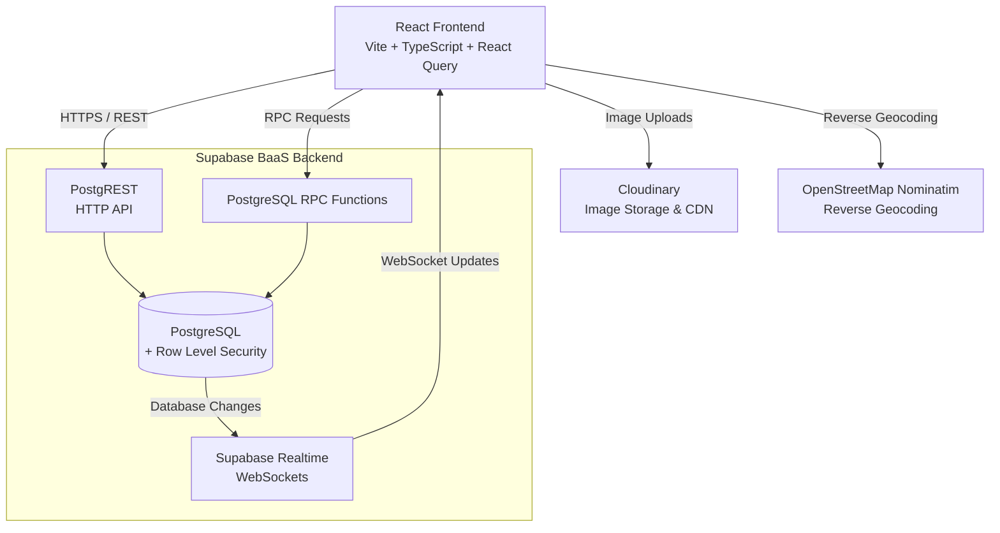

# PawConnect 🐾

**PawConnect** is a modern, community-driven web application designed to connect stray, abandoned, and lost animals in Sri Lanka with loving forever homes.

The platform allows communities to report stray animals, publish lost-pet alerts, discover animals available for adoption, and interact with other users.

PawConnect follows a **Serverless / Backend-as-a-Service (BaaS) architecture** powered primarily by **Supabase**, with **Cloudinary** for media management and **OpenStreetMap Nominatim** for reverse geocoding.

> **There is no standalone custom backend server such as Express.js, Node.js, Django, or Spring Boot.**
> The React frontend communicates directly with managed backend services through the Supabase client, REST APIs, RPC functions, and WebSockets.

---

## ✨ Features

* 🐾 **Browse Animals**
  Browse reported stray and adoptable animals through responsive animal cards.

* 🚨 **Lost & Found Alerts**
  View recent missing-pet reports and alerts.

* 📱 **Responsive Design**
  Mobile-first interface with native-app-inspired navigation and desktop layouts.

* 🔍 **Advanced Filtering**
  Filter animals by species, gender, and status.

* 📍 **Report Strays & Lost Pets**
  Authenticated users can submit animal reports with images, contact details, and location information.

* 💬 **Community Interactions**
  Users can like, react to, and comment on animal reports.

* ⚡ **Real-Time Updates**
  Live updates for comments, reactions, notifications, and animal-related changes.

* 🌐 **Multi-Language Support**
  Full localization for:

  * English (`en`)
  * Sinhala (`si`)
  * Tamil (`ta`)

* 📊 **Analytics Dashboard**
  Visual statistics for rescues, adoptions, and geographical distributions.

* 🗺️ **Location Services**
  GPS-based reporting with reverse geocoding through OpenStreetMap Nominatim.

---

# 🏗️ System Architecture

PawConnect uses a **Serverless / Backend-as-a-Service (BaaS)** architecture.

Instead of maintaining a traditional backend application server, the frontend communicates directly with managed backend services.



---

# 🔌 Backend Architecture

PawConnect's backend is provided through **Supabase BaaS**.

Supabase provides the majority of backend functionality required by the application:

* PostgreSQL database
* PostgREST REST API
* Row Level Security
* PostgreSQL functions and RPC
* Realtime WebSockets
* Authentication infrastructure
* Database triggers and policies

There is **no separate Express.js or Node.js backend server**.

The overall architecture is:

```text
React Frontend
      │
      ▼
TanStack Query
      │
      ▼
Supabase JavaScript Client
      │
      ├──────────────► PostgREST
      │                    │
      │                    ▼
      │               PostgreSQL
      │                    │
      │                    ▼
      │                   RLS
      │
      ├──────────────► PostgreSQL RPC
      │
      └──────────────► Supabase Realtime
```

---

# 🌐 API & Data Access

## PostgREST

Supabase automatically exposes PostgreSQL data through **PostgREST**.

The frontend uses the Supabase JavaScript client to perform operations such as:

* Fetching animal reports
* Creating animal reports
* Updating animal information
* Retrieving comments
* Creating comments
* Managing reactions
* Retrieving notifications
* Updating application data

The request flow is:

```text
React Application
       ↓
Supabase JavaScript Client
       ↓
PostgREST HTTP API
       ↓
PostgreSQL
```

This removes the need for a manually developed REST API server.

---

# 🔐 Authentication & Secure Operations

Application-specific authentication and sensitive operations use **PostgreSQL stored functions** exposed through Supabase RPC.

These functions handle operations such as:

* User registration
* User login
* Password updates
* Secure user-related operations

The architecture is:

```text
React Frontend
      ↓
Supabase RPC
      ↓
PostgreSQL Function
      ↓
PostgreSQL Database
```

Sensitive database logic therefore remains inside the managed Supabase backend environment.

---

# 🛡️ Security & Authorization

PawConnect uses **PostgreSQL Row Level Security (RLS)** as a core authorization mechanism.

Rather than relying solely on frontend checks, access control is enforced directly at the database layer.

### Security model

1. **Row Level Security**

   * PostgreSQL tables are protected by RLS policies.
   * Policies determine which records users can access or modify.

2. **Ownership Verification**

   * User-owned resources are associated with their respective users.
   * Database policies verify ownership before allowing protected operations.

3. **Secure Request Context**

   * Protected operations can provide user-specific security information through the request context.
   * PostgreSQL policies use this information when evaluating authorization.

4. **Database-Level Enforcement**

   * Authorization is enforced inside PostgreSQL.
   * Client-side restrictions alone are not relied upon for security.

5. **Database Constraints**

   * Appropriate database constraints help maintain data integrity and validation.

### Authorization flow

```text
User
 ↓
React Frontend
 ↓
Supabase Client
 ↓
PostgREST / RPC
 ↓
PostgreSQL
 ↓
RLS Policy
 ↓
Authorized?
 ├── Yes → Database Operation
 └── No  → Request Rejected
```

---

# ⚡ Real-Time Architecture

PawConnect uses **Supabase Realtime** for live application updates.

When relevant database changes occur, Supabase can broadcast those changes to connected clients through WebSockets.

```text
PostgreSQL Change
       ↓
Supabase Realtime
       ↓
WebSocket
       ↓
React Application
       ↓
TanStack Query
       ↓
Updated UI
```

Realtime functionality is used for features such as:

* Comments
* Reactions
* Notifications
* Animal report updates
* Community activity

---

# 🖼️ Media Architecture

Animal images are handled through **Cloudinary** rather than being stored directly inside PostgreSQL.

Images are compressed and optimized on the client before being uploaded to Cloudinary.

```text
User
 ↓
React Application
 ↓
Client-Side Image Compression
 ↓
Cloudinary
 ↓
Optimized Image
 ↓
CDN
 ↓
PawConnect UI
```

Cloudinary provides:

* Image storage
* Image optimization
* Dynamic transformations
* Responsive delivery
* CDN distribution

The database stores the relevant image references rather than the image files themselves.

---

# 🗺️ Location Services

PawConnect uses **OpenStreetMap Nominatim** for reverse geocoding.

When a user reports an animal using GPS coordinates, the coordinates can be converted into a human-readable location.

```text
GPS Coordinates
       ↓
React Application
       ↓
OpenStreetMap Nominatim
       ↓
Human-Readable Location
       ↓
Animal Report
```

---

# 📦 State Management

PawConnect uses **TanStack Query** for server-state management.

It handles:

* Data fetching
* Request caching
* Cache invalidation
* Mutations
* Loading states
* Error handling
* Backend synchronization
* Realtime data updates

Global client-side state, such as user information and preferences, is handled through React Context.

---

# 🌐 Internationalization

PawConnect currently supports three languages:

| Language | Code |
| -------- | ---- |
| English  | `en` |
| Sinhala  | `si` |
| Tamil    | `ta` |

Internationalization is implemented using **i18next**, allowing the application interface to dynamically switch between supported languages.

---

# 🛠️ Technology Stack

## Frontend

| Technology        | Purpose                       |
| ----------------- | ----------------------------- |
| **React 18**      | User interface                |
| **Vite**          | Development and build tooling |
| **TypeScript**    | Static typing                 |
| **React Router**  | Client-side routing           |
| **Tailwind CSS**  | Styling                       |
| **Framer Motion** | Animations and interactions   |

## Backend / BaaS

| Technology             | Purpose                                |
| ---------------------- | -------------------------------------- |
| **Supabase**           | Backend-as-a-Service                   |
| **PostgreSQL**         | Relational database                    |
| **PostgREST**          | REST API                               |
| **Supabase Realtime**  | WebSocket-based realtime communication |
| **PostgreSQL RPC**     | Database-side business logic           |
| **Row Level Security** | Database authorization                 |

## State & Localization

| Technology            | Purpose                  |
| --------------------- | ------------------------ |
| **TanStack Query v5** | Server-state management  |
| **React Context**     | Global client-side state |
| **i18next**           | Internationalization     |

## External Services

| Service                     | Purpose                              |
| --------------------------- | ------------------------------------ |
| **Cloudinary**              | Image storage, optimization, and CDN |
| **OpenStreetMap Nominatim** | Reverse geocoding                    |

---

# 📂 Project Structure

```text
PawConnect/
│
├── supabase/
│   └── migrations/
│       └── Database schema,
│           RLS policies,
│           functions, and triggers
│
├── src/
│   ├── components/
│   │   ├── ui/
│   │   └── Layout.tsx
│   │
│   ├── contexts/
│   │   └── UserContext.tsx
│   │
│   ├── hooks/
│   │   ├── useAnimals.ts
│   │   ├── useComments.ts
│   │   ├── useNotifications.ts
│   │   └── useReactions.ts
│   │
│   ├── i18n/
│   │
│   ├── integrations/
│   │
│   ├── pages/
│   │
│   └── utils/
│
├── public/
│
├── package.json
└── README.md
```

---

# 🚀 Getting Started

## Prerequisites

Make sure the following are installed or available:

* Node.js 18+
* Git
* Supabase account and project
* Cloudinary account

---

## 1. Clone the Repository

```bash
git clone https://github.com/yourusername/pawconnect.git
cd pawconnect
```

---

## 2. Install Dependencies

```bash
npm install
```

---

## 3. Configure Environment Variables

Create a `.env` file in the project root.

Required configuration includes:

```text
Supabase Project URL
Supabase Publishable Key
Cloudinary Cloud Name
Cloudinary Upload Preset
```

Do not commit private credentials or secrets to the repository.

---

## 4. Configure the Database

The database schema, functions, triggers, and RLS policies are maintained under:

```text
supabase/migrations/
```

Apply the migrations to the Supabase project in the required order.

Make sure the security-hardening migration is applied so that the required **Row Level Security policies** are enabled.

---

## 5. Run the Development Server

```bash
npm run dev
```

The Vite development server will display the local development URL in the terminal.

---

# ☁️ Deployment Architecture

PawConnect does not require a dedicated backend server for deployment.

A production deployment can use a static frontend hosting provider together with Supabase and Cloudinary.

```text
                         ┌─────────────────┐
                         │   Web Browser   │
                         └────────┬────────┘
                                  │
                                  ▼
                         ┌─────────────────┐
                         │ React Frontend  │
                         │ Vite Application│
                         └────────┬────────┘
                                  │
              ┌───────────────────┼───────────────────┐
              │                   │                   │
              ▼                   ▼                   ▼
       ┌─────────────┐     ┌─────────────┐     ┌──────────────┐
       │  Supabase   │     │ Cloudinary  │     │ OpenStreetMap│
       │     BaaS    │     │    Media    │     │  Nominatim   │
       └──────┬──────┘     └─────────────┘     └──────────────┘
              │
              ▼
       ┌─────────────┐
       │ PostgreSQL  │
       │    + RLS    │
       └─────────────┘
```

### Deployment Components

* **Frontend:** Static React/Vite application
* **Backend:** Supabase BaaS
* **Database:** Supabase PostgreSQL
* **Realtime:** Supabase Realtime
* **Media:** Cloudinary
* **Geocoding:** OpenStreetMap Nominatim

This architecture significantly reduces infrastructure and backend maintenance requirements.

---

# 🧩 Why BaaS?

Using a Backend-as-a-Service architecture allows PawConnect to focus primarily on the application experience while delegating infrastructure management to managed services.

### Advantages

* No custom backend server to maintain
* No API server infrastructure to manage
* Managed PostgreSQL database
* Automatically generated REST API
* Database-level authorization
* Built-in realtime capabilities
* Managed authentication infrastructure
* Easy frontend integration
* Independent media infrastructure
* Reduced operational complexity

### Architectural Trade-Offs

The BaaS approach also means that application logic is distributed across several layers:

```text
Frontend
   +
Supabase Services
   +
PostgreSQL Functions
   +
RLS Policies
   +
Cloudinary
   +
External APIs
```

This makes database design, authorization policies, and service boundaries particularly important.

---

# 📈 Scalability

The serverless architecture allows individual components to scale independently.

For example:

* **Frontend** can be served through a CDN.
* **Supabase** manages database and backend infrastructure.
* **PostgreSQL** handles structured application data.
* **Supabase Realtime** manages live connections.
* **Cloudinary** handles media processing and delivery.
* **OpenStreetMap Nominatim** provides geocoding functionality.

This avoids maintaining a continuously running custom application server for the core platform.

---

# 🔒 Security Principles

PawConnect follows several security principles:

* Database-level Row Level Security
* Ownership-based authorization
* Secure PostgreSQL functions for sensitive operations
* Database constraints for data integrity
* Environment variables for service configuration
* No private service credentials exposed in the frontend
* Client-side validation combined with database-level enforcement
* Controlled access to user-owned resources

---

# 📜 License

Distributed under the **MIT License**.

See [`LICENSE`](LICENSE) for more information.

---

# ❤️ Project Vision

PawConnect aims to make animal rescue and adoption more accessible by connecting people, communities, and animals through a single digital platform.

> **Every life deserves a home.**
