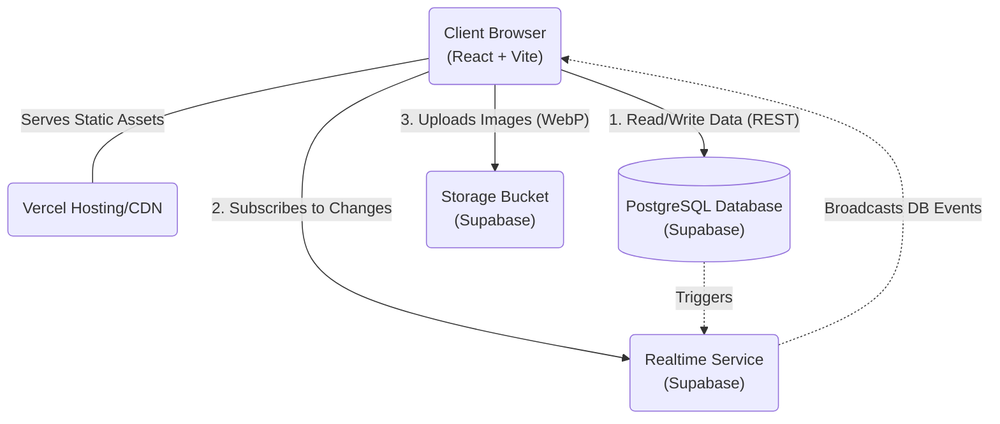
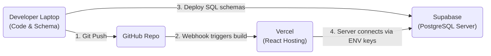

# PawsLK Platform - Technical Documentation

This document provides a comprehensive technical overview of the PawsLK pet adoption and reporting platform. It covers the high-level system architecture, data flows, database/API documentation, technical decision rationales (the "Why"), and a step-by-step deployment guide.

---

## 1. System Architecture

The PawsLK platform follows a modern, serverless architecture that relies on a decentralized frontend communicating directly with a fully-managed backend as a service (BaaS).

### High-Level Architecture Diagram


### Data Flow Overview
1. **Asset Delivery**: Vercel serves the static React (Vite-bundled) assets to the user's browser.
2. **Authentication/Authorization**: Instead of traditional sessions, the system uses a frictionless "Mobile First" login. A server-generated `user_token` (UUID) is sent to the client and stored in `localStorage`. 
3. **Data Operations**: The React app makes direct calls to Supabase via `@supabase/supabase-js`. 
   - **Reads (SELECT)** and **Inserts (INSERT)** use the standard public anonymous key.
   - **Updates (UPDATE)** are executed using a *Secure Client* that passes the `user_token` in a custom `x-user-token` HTTP header. 
   - The PostgreSQL database enforces Row Level Security (RLS) policies by comparing the incoming header token against the token saved in the `users` table for the row owner.
4. **Realtime**: Changes on the `animals` table trigger Postgres Realtime events, which instruct the client's React Query cache to automatically invalidate and re-fetch feeds, ensuring users are always looking at live, synchronized data.

---

## 2. API Documentation (Supabase Database API)

Because PawsLK relies on Supabase, the "API" is defined by the PostgreSQL schema and the client operations accessing it.

### Database Tables

#### `users` Table
Stores registered users.
- `id` (UUID): Primary key.
- `name` (TEXT): The user's display name.
- `mobile` (TEXT, UNIQUE): Mobile number used for authentication.
- `country_code` (TEXT): Default `+94`.
- `language` (TEXT): `en`, `si`, or `ta`.
- `user_token` (UUID): **Crucial Secret.** This token is automatically generated upon insertion. It is never exposed publicly and is used as a password stand-in for authorization.

#### `animals` Table
Stores stray animal reports and adoption postings.
- `id` (UUID): Primary key.
- `user_id` (UUID): Foreign key linking to the `users` table. Identifies the owner.
- `type` (TEXT): Enum-like, either `'dog'` or `'cat'`.
- `gender` (TEXT): Enum-like, either `'male'` or `'female'`.
- `photo_url` (TEXT, Nullable): URL to the image hosted in Supabase Storage.
- `location_name` (TEXT): Location where the animal was found/is located.
- `description` (TEXT, Nullable): Additional details.
- `is_adopted` (BOOLEAN): Status flag. Default `false`.
- `adopted_at` (TIMESTAMP, Nullable): Timestamp of when the animal was adopted.
- `contact_number` (TEXT, Nullable): Mobile number to contact.

### Operations (Frontend Data Hooks)

All interactions are facilitated through React Query hooks inside `src/hooks/useAnimals.ts` and `src/contexts/UserContext.tsx`.

| Action | Function Name | Request Data | Returns | RLS Security Level |
|---|---|---|---|---|
| **Register / Login** | `registerUser` | `{ name, mobile, language }` | Newly created/existing user object **including** `user_token`. | Public `INSERT` |
| **Fetch Feed** | `useAnimals` / `useWaitingAnimals` | Filter configs (type, gender, pagination/search) | Array of `Animal` objects | Public `SELECT` |
| **Fetch Stats** | `useAnimalStats` | None | Object containing aggregates (adoption rates, location counts, etc.) | Public `SELECT` |
| **Report Animal** | `useReportAnimal` | `{ type, location_name, user_id, ... }` | Inserted `Animal` row | Public `INSERT` |
| **Upload Image** | `useUploadPhoto` | WebP `File` blob | `publicUrl` string | Upload Check: Restricted to image files `< 5MB`. |
| **Update Post** | `useUpdateAnimal` | `{ id, userToken, updates }` | Updated `Animal` row | **Secure**: Evaluates `x-user-token` custom header. |
| **Mark Adopted** | `useMarkAdopted` | `{ id, userId, userToken }` | Void | **Secure**: Evaluates `x-user-token` custom header. |

---

## 3. The "Why" in Code

The codebase contains several non-standard design patterns implemented to optimize user experience and platform security. Here is the rationale behind these decisions:

> [!TIP]
> **Custom Header Authentication Extravaganza (`x-user-token`)**
> 
> *The Code:* `createSecureClient(userToken)` in `src/utils/supabase.ts` attaches `x-user-token` to headers. `20260405170000_security_hardening.sql` RLS policy reads this via `current_setting('request.headers', true)::json->>'x-user-token'`.
> 
> *The Why:* PawsLK uses a frictionless "Mobile-First" onboarding experience. Requiring standard email/password or OAuth (which Supabase Auth enforces out-of-the-box) would introduce severe friction for local Sri Lankan users reporting strays on the go. Instead, users are simply created in a public `users` table via their mobile numbers. To ensure malicious actors cannot `UPDATE` other users' posts or profiles, the database auto-generates a secure `user_token` UUID that is sent to the client once upon registration/login. The platform intercepts UPDATE calls, injects this token into the request header, and the Postgres RLS policy validates it before executing the modification.

> [!NOTE]
> **Client-Side Image Compression**
> 
> *The Code:* `browser-image-compression` in `src/utils/imageCompression.ts` is dynamically imported and forces conversion to `WebP` and max boundaries (1200px / < 300KB) before the `supabase.storage...upload()` call.
> 
> *The Why:* Image uploads are a massive bandwidth vulnerability. To prevent users from uploading unoptimized 4K smartphone photos (which would bloat the storage bucket, trigger 5MB RLS limits, and drastically slow down the feed for users on 3G/4G networks), images are aggressively compressed *in the browser* using an async Javascript worker before they ever touch the network or the backend.

> [!IMPORTANT]
> **No DELETE Operations**
> 
> *The Code:* Explicit `USING (false)` RLS policies for `DELETE` commands on `users` and `animals`.
> 
> *The Why:* To maintain an immutable audit trail of community reports and platform adoption history (which drives the platform's statistics and data visualization page), user accounts and animal logs cannot be permanently deleted via the API. Instead of deleting, users "Mark as Adopted," which simply flips the `is_adopted` boolean toggle. 

---

## 4. Deployment Steps

Follow these steps to take the code from your local machine to the live internet.

### Pre-Requisites
1. A GitHub account with the PawsLK codebase uploaded to a repository.
2. A free Supabase Account (supabase.com).
3. A free Vercel Account (vercel.com).

### Step 1: Backend Setup (Supabase)
1. Log into Supabase and create a new Project. 
2. Wait for the database to provision.
3. Open your project dashboard and go to **Settings > API**. Note down the **Project URL** and the **anon `public` API Key**.
4. You need to apply your schema. Open the **SQL Editor** in the Supabase Dashboard. 
5. Locally, locate the `supabase/migrations/` folder.
6. **IMPORTANT:** Copy the contents of the files in sequential order (based on their timestamp prefix) and run them in the Supabase SQL Editor.
   * `20260404203325_...sql`
   * `20260405120000_add_gender_to_animals.sql`
   * `20260405133000_drop_lat_long_from_animals.sql`
   * `20260405160000_add_users_table.sql`
   * `20260405170000_security_hardening.sql`
7. Go to **Storage (left panel)** and create a new bucket named exactly `animal-photos`. Ensure the bucket is set to **Public**.

### Step 2: Source Code Environment Setup
1. In the root of your local codebase repository, create a `.env` file (if it doesn't exist).
2. Insert the keys you copied from Supabase:
   ```env
   VITE_SUPABASE_URL=your_project_url_here
   VITE_SUPABASE_PUBLISHABLE_KEY=your_anon_key_here
   ```
3. Commit everything and push to GitHub.

### Step 3: Frontend Deployment (Vercel)
1. Log into Vercel and click **Add New... > Project**.
2. Connect your GitHub account and select your PawsLK repository.
3. Vercel will automatically detect that this is a **Vite** project and configure the build settings (`npm run build` / `dist` folder).
4. **Environment Variables:** Before clicking Deploy, expand the "Environment Variables" dropdown. Add the exact same variables you put in your `.env` file:
   - Name: `VITE_SUPABASE_URL` | Value: `[Your Project URL]`
   - Name: `VITE_SUPABASE_PUBLISHABLE_KEY` | Value: `[Your Anon Key]`
5. Click **Deploy**. Vercel will build your application and provide you with a live, SSL-secured URL.

### Deployment Workflow Diagram

